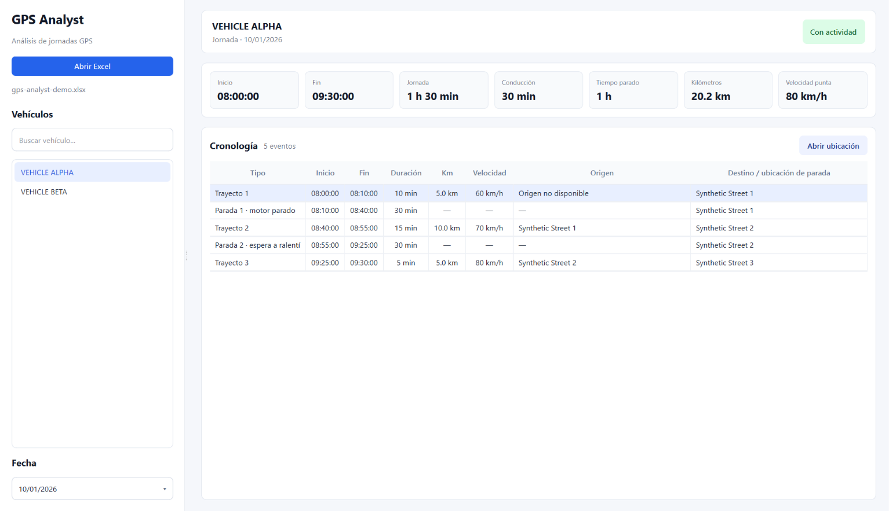

# GPS Analyst

GPS Analyst is a Windows desktop application for reconstructing and reviewing
vehicle activity from GPS tracking exports.

The current release supports XLSX exports from **Automatica PLUS** and
transforms low-level tracking records into a chronological, human-readable
view of each vehicle day.

**Stable release:** `v0.1.0`

## What it does

GPS Analyst can:

- import XLSX exports in read-only mode;
- detect vehicles and available dates;
- identify active and inactive days;
- reconstruct trips and intermediate stops;
- calculate activity start and end times;
- calculate driving and stopped time;
- summarize distance and maximum speed;
- preserve available map links;
- distinguish trip origin, trip destination and stop location;
- validate reconstructed values against source totals;
- present the result through a native Windows desktop interface.

The objective is not only to calculate values, but to make a GPS day
**understandable and auditable**.

## Desktop application




The application is built with **Python 3.12** and **PySide6**.

Typical workflow:

```text
Open XLSX
    ↓
Select vehicle
    ↓
Select date
    ↓
Review daily summary
    ↓
Inspect trips and stops
    ↓
Open source map location when available
```

The interface presents:

- start and end of activity;
- total day duration;
- driving time;
- stopped time;
- kilometres;
- maximum speed;
- chronological trips and stops;
- explicit origin and destination semantics.

When the source does not provide the initial origin of the day, GPS Analyst
reports it as unavailable instead of inferring or inventing a location.

## Architecture

The project separates source-specific parsing from the common analysis model:

```text
Automatica PLUS XLSX
        ↓
AutomaticaPlusExcelSource
        ↓
Common GPS model
        ↓
GpsDayAnalysisService
        ↓
GpsDayPresenter
        ↓
Workbook session
        ↓
PySide6 desktop UI
```

This separation allows future source adapters or comparison layers to reuse
the same analysis and presentation services.

Main package structure:

```text
gps_analyst/
├── app.py
├── models/
│   ├── gps.py
│   ├── analysis.py
│   └── presentation.py
├── services/
│   ├── journey_analysis.py
│   ├── day_presenter.py
│   └── workbook_session.py
└── sources/
    └── automatica_plus_excel.py
```

## Source normalization

Real-world GPS exports are not always perfectly uniform.

The importer therefore keeps source parsing and normalization explicit.
Among the cases covered by the current implementation:

- opening rows that are not real journeys;
- intermediate stops and final journey rows;
- inactive days;
- durations longer than 24 hours;
- decimal values using comma notation;
- zero-distance activity;
- values carried over into opening rows;
- exceptional cases where an opening row is omitted;
- accumulated rounding differences in displayed distances.

Raw source values are preserved where useful, while normalized values are
used only when the source summary and timeline consistency support the
correction.

## Journey reconstruction

`GpsDayAnalysisService` converts each normalized vehicle day into a complete
chronology.

It produces:

- trips with start, end, duration, distance, maximum speed and destination;
- stops with start, end, duration, stop type and location;
- continuous timing from the start to the end of the recorded day;
- support for inactive days;
- validation of timing and distance consistency.

## Presentation layer

`GpsDayPresenter` converts the technical analysis into a reusable
human-facing model.

This keeps formatting and UI concerns separate from GPS interpretation logic
and allows the same analysis results to be reused by other interfaces or
reporting layers.

## Tests

The repository contains a fully reproducible test suite.

By default:

```cmd
python -m pytest -q
```

uses generated synthetic XLSX fixtures. No operational GPS files are
required.

Current release:

```text
30 tests
30 passed
```

For local development, the same suite can optionally be run against private
regression files stored outside Git:

```cmd
set GPS_ANALYST_TEST_DATA=private
python -m pytest -q
set GPS_ANALYST_TEST_DATA=
```

The private regression dataset is not required to build, test or understand
the project.

## Windows distribution

GPS Analyst can be packaged as a standalone Windows application with
PyInstaller.

Install build dependencies:

```cmd
python -m pip install -r requirements-build.txt
```

Build:

```cmd
BUILD_GPS_ANALYST.cmd
```

The resulting distribution is:

```text
dist\GPS Analyst\
├── GPS Analyst.exe
└── _internal\
```

The complete `GPS Analyst` folder must be distributed together.

The target Windows computer does not need Python or a virtual environment
installed.

The build process:

1. runs the reproducible test suite;
2. cancels packaging if tests fail;
3. builds the PySide6 application;
4. verifies that no XLSX file is embedded;
5. verifies that no private data directory is embedded.

## Running from source

Create and activate a Python virtual environment, then install:

```cmd
python -m pip install -r requirements.txt
```

Launch with:

```cmd
ABRIR_GPS_ANALYST.cmd
```

or:

```cmd
python -m gps_analyst.app
```

## Privacy and data handling

Operational GPS information can contain sensitive business or personal data.

The repository therefore excludes:

```text
data/private/
build/
dist/
.venv/
```

Real exports, vehicle identifiers, employee information, GPS positions and
customer data are never required by the public test suite.

The synthetic fixtures use fictional vehicle names, locations and
`example.test` map URLs.

## Release

Current stable version:

```text
v0.1.0
```

The Git tag `v0.1.0` identifies the first stable release.

## License

The source code is publicly visible for portfolio and evaluation purposes.

It is **not released under an open-source license**. See `LICENSE` for usage
terms.

## Third-party notice

Automatica PLUS is a third-party product. This project is an independent
analysis tool and is not affiliated with or endorsed by its vendor.

Third-party Python packages remain subject to their respective licenses.
